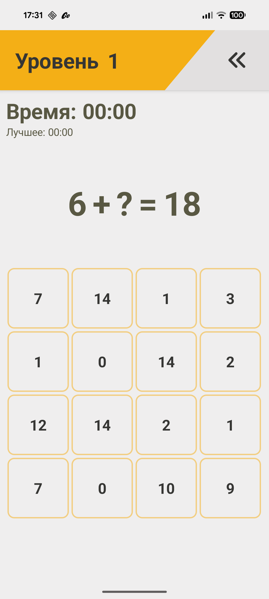
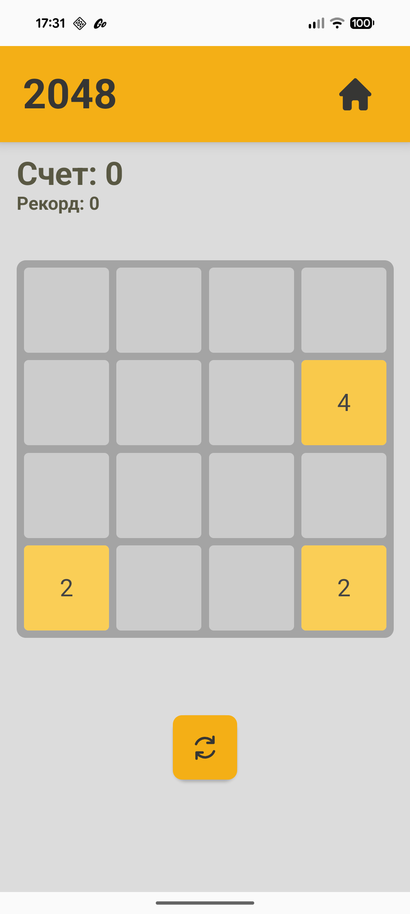
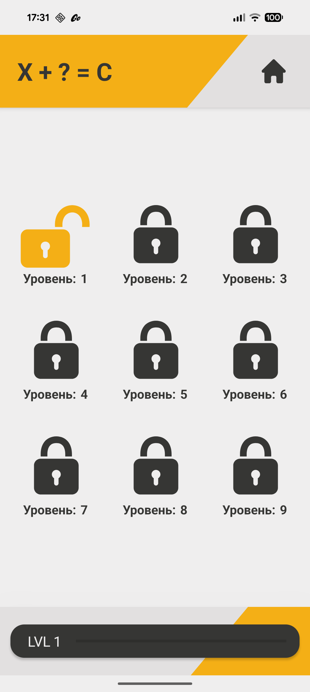
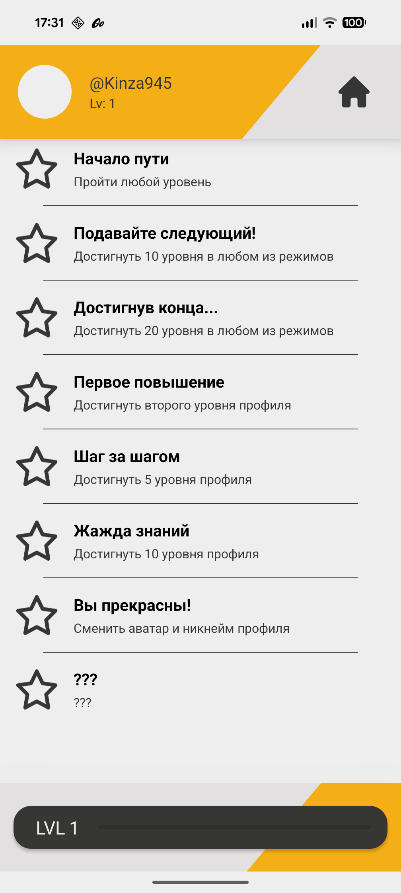

# MathMastery

Мобильное приложение для изучения математики, разработанное на Android с использованием Kotlin и Java.

## 📱 О проекте

MathMastery - это образовательное приложение, которое помогает пользователям изучать и практиковать математические концепции в интерактивной форме.

## 📸 Скриншоты

<!-- Добавьте скриншоты приложения здесь -->
<p align="center">
  
  
  
  
  

- `game2048_screen.png` - Экран с игрой 2048
- `game_menu_screen.png` - Экран с уровнями математических упражнений
- `progress_screen.png` - Экран отслеживания прогресса
</p>

*Скриншоты будут добавлены в    ближайшее время*

## 🛠 Технологии

- **Java** - основная логика приложения
- **Kotlin** - современная разработка Android
- Android SDK
- Android Studio
- Material Design
- Room Database (планируется)
-

## 🚀 Начало работы

### Требования

- Android Studio 8.0+
- Android SDK 21+
- JDK 8+

### Установка

1. Клонируйте репозиторий:
```bash
git clone https://github.com/Remb022/MathMastery_rep.git
```

2. Откройте проект в Android Studio

3. Синхронизируйте проект с Gradle файлами

4. Запустите приложение на эмуляторе или физическом устройстве

## 📖 Текущая функциональность

- ✅ Интерактивные математические упражнения
- ✅ Различные уровни сложности
- ✅ Удобный пользовательский интерфейс
- ✅ Поддержка темной и светлой темы

## 🔮 Планы на будущее

### Версия 2.0 (Q1 2025)
- 🔄 **Миграция на Jetpack Compose** - современный UI фреймворк
- 🏗️ **Clean Architecture** - улучшенная архитектура приложения
- 🗄️ **Room Database** - локальное хранение данных
- 📊 **Детальная аналитика прогресса** - графики и статистика
- 🤖 **ИИ-помощник** - персонализированные рекомендации
- 📚 **Расширенные разделы математики** - алгебра, геометрия
- 👨‍🏫 **Режим преподавателя** - создание собственных заданий
- 🌍 **Многоязычность** - поддержка нескольких языков

### Долгосрочные планы
- 📱 **iOS версия** - кроссплатформенная поддержка
- 🌐 **Веб-версия** - доступ через браузер
- 🔗 **API для интеграций** - подключение к образовательным платформам


## 🤝 Вклад в проект

Мы приветствуем вклад в развитие проекта! Пожалуйста:

1. Форкните репозиторий
2. Создайте ветку для новой функции
3. Зафиксируйте изменения
4. Отправьте в ветку
5. Откройте Pull Request

### Гайдлайны для контрибьюторов
- Следуйте стилю кода проекта
- Добавляйте тесты для новой функциональности
- Обновляйте документацию при необходимости
- Используйте описательные commit сообщения

## 📈 Статистика проекта

- 📊 **96 коммитов** от команды разработчиков
- 🔄 **Активная разработка** с января 2025
- 💻 **65.8% Java, 34.2% Kotlin** - смешанная кодовая база
- ⭐ **0 звезд** - помогите нам набрать первые!

## 📝 Лицензия

Этот проект распространяется под лицензией MIT. См. файл `LICENSE` для получения дополнительной информации.

## 📞 Контакты

- Основной разработчик: [@Kinza945](https://github.com/Kinza945)
- Владелец проекта: [@Remb022](https://github.com/Remb022)
- 📧 Email: egort.egort05@mail.ru

## 🔗 Полезные ссылки

- [Issues](https://github.com/Remb022/MathMastery_rep/issues) - сообщить о баге или предложить улучшение
- [Pull Requests](https://github.com/Remb022/MathMastery_rep/pulls) - внести свой вклад в код

## 🙏 Благодарности

Спасибо всем контрибьюторам, которые помогают развивать проект!

---

⭐ **Поставьте звезду, если проект вам понравился!** ⭐

*Сделано с ❤️ командой MathMastery*